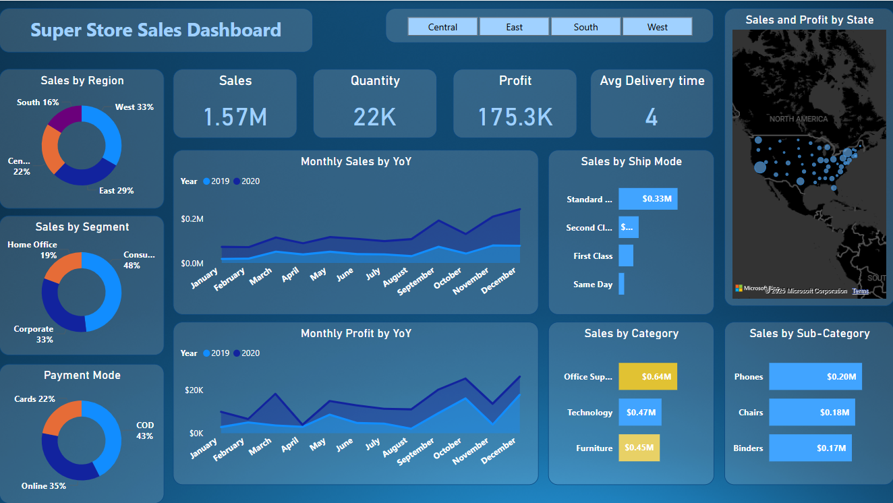
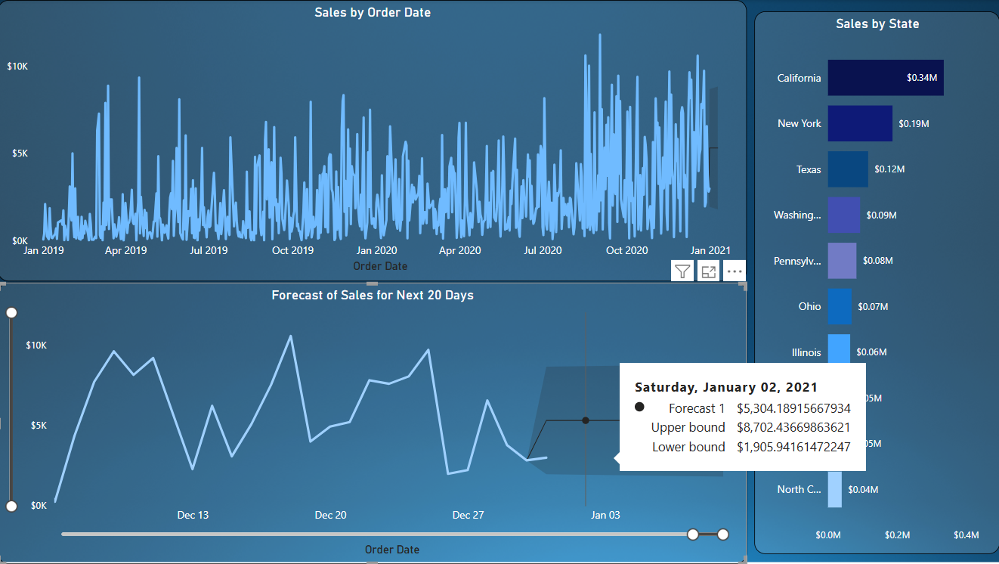

# Sales-Dashboard-PowerBI

This project is an interactive sales dashboard built using Power BI to analyze SuperStore sales data across different regions, segments, and categories.

---

## 📁 Files Included

- `Sales Dashboard.pbix` - Power BI report file
- `SuperStore_Sales_Dataset.csv` - Raw sales data used to build the dashboard
- `Screenshot-Dashboard.png` - Overview of the main dashboard
- `Screenshot-Forecast.png` - Sales forecasting visual

---

## 🔍 Dashboard Features

- **Sales by Region, Segment, Category, and Sub-Category**
- **Monthly Sales and Profit YoY Comparison**
- **Ship Mode Analysis**
- **Payment Mode Distribution**
- **Sales and Profit by State (Map View)**
- **Sales Trend by Order Date**
- **Forecast for Next 20 Days (with Confidence Bounds)**
- **KPI Cards:** Total Sales, Quantity, Profit, Avg Delivery Time

---

## 🛠 Tools & Technologies

- Power BI
- DAX (Data Analysis Expressions)
- Time Series Forecasting
- Power Query (Data Cleaning & Transformation)

---

## 📈 Key Insights

- **Highest Sales**: In the West region and Consumer segment
- **Top Performing States**: California ($0.34M), New York ($0.19M)
- **Sales Forecasting**: Predicts up to $8.7K in early January 2021
- **Top Categories**: Office Supplies, Technology
- **Ship Mode Usage**: Standard Class is the most used mode

---

## 📌 How to Use

1. Clone or download this repository.
2. Open `Sales Dashboard.pbix` in Power BI Desktop.
3. Explore the visuals or connect your own SuperStore dataset.

---

## 📷 Dashboard Previews

### Overview Dashboard

### Forecast Dashboard

---

## 🤝 Let's Connect!

If you found this project useful or have suggestions, feel free to open an issue or connect with me.

